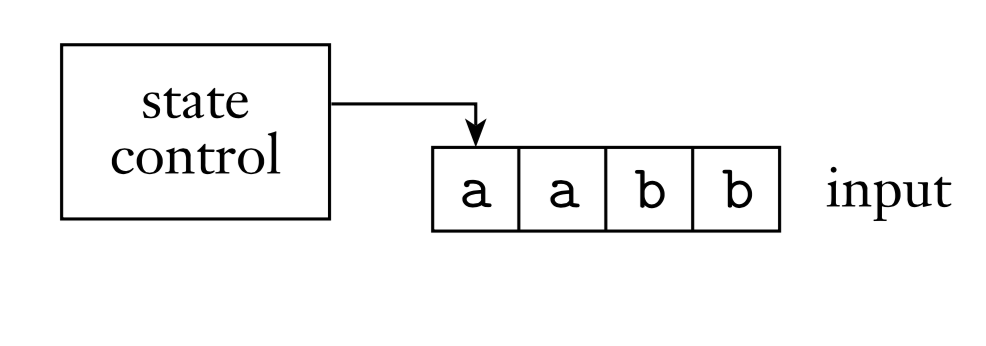

# Introduction

## Pushdown Automata

* In this section we introduce a new type of computational model called **pushdown automata** (PDA).
* These automata are like nondeterministic finite automata but have an extra component called a **stack**.
* The stack provides additional memory beyond the finite amount available in the control.
* The stack allows pushdown automata to recognize some nonregular languages.

## Pushdown Automata

* Pushdown automata are equivalent in power to context-free grammars.
* This equivalence is useful because it gives us two options for proving that a language is context free.
* We can give either a context-free grammar generating it or a pushdown automaton recognizing it.
* Certain languages are more easily described in terms of generators, whereas others are more easily described by recognizers.

## Finite Automaton Schematic

{.stretch}

## Pushdown Automaton Schematic

{.stretch}

## Stacks

{.stretch}

## Stacks

* Stacks operate by pushing and popping
* Pushing adds a new element to the top of the stack
* Popping remove the top element of the stack
* Stacks are first-in-last-out (FILO) data structures

# Definition of a PDA

## Defining a PDA

* The formal definition of a pushdown automaton is similar to that of a finite automaton, except for the stack.
* The stack is a device containing symbols drawn from some alphabet.
* The machine may use different alphabets for its input and its stack, so now we specify both an input alphabet Σ and a stack alphabet Γ.

## PDA Transition Function

* At the heart of any formal definition of an automaton is the transition function, which describes its behavior.
* Recall that Σ~ε~ = Σ ∪ {ε} and Γ~ε~ = Γ ∪ {ε}.
* The domain of the transition function is Q × Σ~ε~ × Γ~ε~.
* Thus the current state, next input symbol read, and top symbol of the stack determine the next move of a pushdown automaton.

## PDA Transition Function

* Either symbol may be ε, causing the machine to move without reading a symbol from the input or without reading a symbol from the stack.
* For the range of the transition function we need to consider what to allow the automaton to do when it is in a particular situation.
* It may enter some new state and possibly write a symbol on the top of the stack.
* The function δ can indicate this action by returning a member of Q together with a member of Γ~ε~, that is, a member of Q × Γε.

## PDA Transition Function

* Because we allow nondeterminism in this model, a situation may have several legal next moves.
* The transition function incorporates nondeterminism in the usual way, by returning a set of members of Q × Γ~ε~, that is, a member of P(Q × Γε).
* Putting it all together, our transition function δ takes the form δ : Q × Σ~ε~ × Γ~ε~ → P( Q × Γ~ε~ ).

## Formal Definition of a PDA

A pushdown automaton is a 6-tuple (Q, Σ, Γ, δ, q~0~, F ), where Q, Σ,
Γ, and F are all finite sets, and

1. Q is the set of states,
2. Σ is the input alphabet,
3. Γ is the stack alphabet,
4. δ: Q × Σ~ε~ × Γ~ε~→ $\mathbb{P}$(Q × Γ~ε~) is the transition function, 5. q~0~ ∈ Q is the start state, and
6. F ⊆ Q is the set of accept states.

# PDA Computation

## PDA Computation

* A pushdown automaton M = (Q, Σ, Γ, δ, q0, F ) computes as follows.
* It accepts input w if w can be written as $w = w_{1}w_{2} ···w_{m}$, where each $w_{i} ∈ Σ_{ε}$ and sequences of states $r_{0},r_{1},...,r_{m} ∈ Q$ and strings $s_{0},s_{1},...,s_{m} ∈ Γ^*$ exist that satisfy the following three conditions.
* The strings s~i~ represent the sequence of stack contents that M has on the accepting branch of the computation.

## PDA Computation

1. r0 = q0 and s0 = ε. This condition signifies that M starts out properly, in the start state and with an empty stack.
2. For i = 0,...,m − 1, we have (r~i~+1,b) ∈ $δ(r_{i},w_{i}+1,a)$, where s~i~ = at and s~i~+1 = bt for some a, b ∈ Γ~ε~ and t ∈ Γ*. This condition states that M moves properly according to the state, stack, and next input symbol.
3. r~m~ ∈ F . This condition states that an accept state occurs at the input
